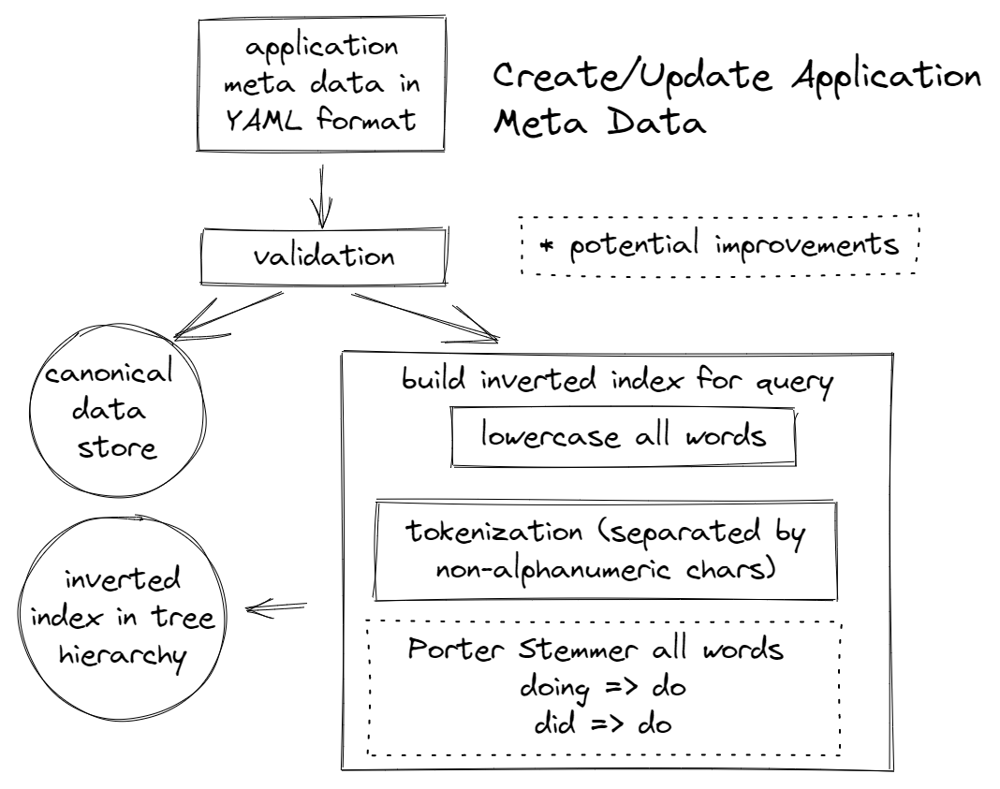
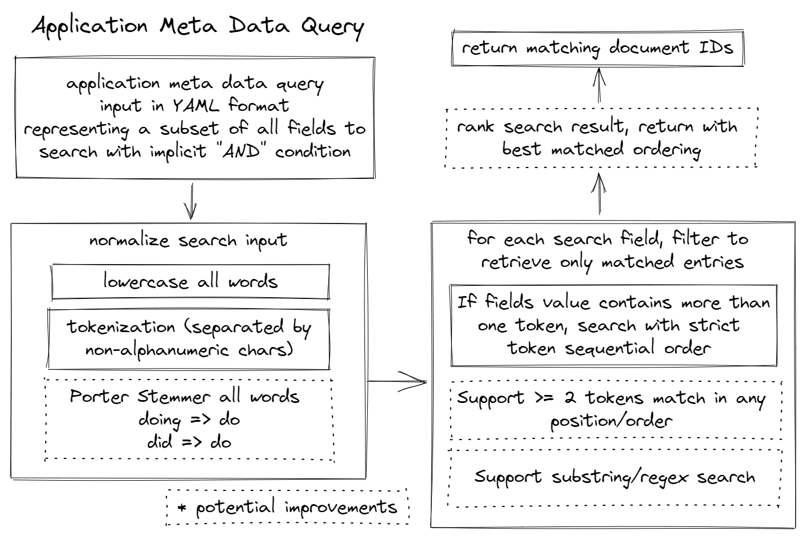

#Application Metadata API Server

This API Server includes both an in-memory data store and a HTTP server. (the in-memory data store will be wiped out after HTTP server restart)

Ideally in a production environment, we should separate stateful data store (and persist the data) and stateless HTTP server, so they can scale independently.

It is also ideal we can have an independent global generate-id microservice that can generate unique app id for the distributed system.

## Workflow

### Create App Data

Create stores in
1. a canonical data store (keyed by id, yaml raw bytes as value)
2. an inverted index in tree hierarchy data structure as the main search space

### Query App Data

Query input is same format (yaml) as creation, but client can specify
only a subset of all fields 

Search by one field: e.g. title, or by multiple fields: e.g. title & version & other fields

## Source code layout
    ├── Dockerfile            # Definition for building docker image
    ├── Makefile              # Convenient commands to build and run the server
    ├── README.md             # 
    ├── cache                 # 
    │   ├── mocks             # 
    │   │   └── store.go      # 
    │   ├── node.go           # 
    │   ├── store.go          #
    │   ├── store_test.go     #
    │   ├── utils.go          #
    │   └── utils_test.go     #
    ├── go.mod                # go module definition
    ├── go.sum                # go module dependencies
    ├── main.go               # API Server entry point
    ├── server                #
    │   ├── api               #
    │   │   └── types.go      # 
    │   ├── error.go          #
    │   ├── http.go           #
    │   ├── http_test.go      #
    │   ├── validator.go      #
    │   └── validator_test.go #
    └── testdata              # sample yaml payload for testing

## Building and running the API server:
### Build the API Server docker image
    make docker-build

### Run a server at :8080 inside a docker container
    make docker-run-server

## If golang toolchain is installed:

### Run unit tests
    make test

### Run curl api client with sample data to insert and query applications
    make test-query

## Example runs:
    make docker-build
    make docker-run-server
    make test-query

    curl --data-binary  "@testdata/valid-payload1.yaml" http://localhost:8080/put
    {"id":"1","message":"App Created"}

    curl --data-binary  "@testdata/valid-payload2.yaml" http://localhost:8080/put
    {"id":"2","message":"App Created"}

    curl --data-binary  "1" http://localhost:8080/get
    title: Valid App 1
    version: 1.0.1
    maintainers:
    - name: firstmaintainer app1
      email: firstmaintainer@hotmail.com
      - name: secondmaintainer app1
        email: secondmaintainer@gmail.com
        company: Random Inc.
        website: https://website.com
        source: https://github.com/random/repo
        license: Apache-2.0
        labels:
        k: xyz
        release:
        name: xyz
        comment: c1
        author:
        name: mary
        email: bob@google.com
        description: |
    ### blob of markdown More markdown ### Interesting Title some application because it is simple...

    curl --data-binary  "@testdata/invalid-payload1.yaml" http://localhost:8080/put
    {"error_message":"Version is required","error_reason":"invalid input yaml"}

    curl --data-binary  "@testdata/invalid-payload2.yaml" http://localhost:8080/put
    {"error_message":"Email email is invalid","error_reason":"invalid input yaml"}

    curl --data-binary  "@testdata/query1.yaml" 		http://localhost:8080/query
    {"result_list":["1"]}

    curl --data-binary  "@testdata/query2.yaml"			http://localhost:8080/query
    {"result_list":["1"]}

    curl --data-binary  "@testdata/query3.yaml" 		http://localhost:8080/query
    {"result_list":["2"]}

    curl --data-binary  "@testdata/query4.yaml" 		http://localhost:8080/query
    {"result_list":["1","2"]}
